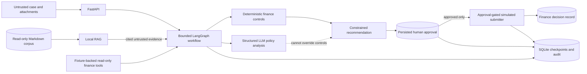

# Financial Processing and RAG Workflow Agent

## What this is

This take-home implements a production-minded Accounts Payable workflow that retrieves finance
policy, gathers simulated ERP evidence, applies deterministic controls, produces a cited structured
recommendation, and pauses before any consequential action. A later human callback resumes the same
persisted run and may create one idempotent **simulated** finance decision; the project cannot move
money, update banking data, or post to an ERP.

The design deliberately uses an explicit LangGraph workflow rather than an open-ended ReAct loop.
Python owns arithmetic, reconciliation, duplicate checks, evidence requirements, authority bands,
state transitions, approval gating, and idempotency. The LLM is limited to validated policy/evidence
synthesis, while RAG supplies untrusted evidence rather than executable instructions.

## Architecture



The structural trust boundary matters more than prompt wording: retrieved text and model output have
no permission to invoke the submitter; the submitter independently verifies persisted approval.

## Key design choices

- **Explicit, bounded orchestration:** fixed LangGraph nodes with persisted step/tool budgets.
- **Deterministic finance truth:** all monetary work uses `Decimal`; controls are traced to current
  supplied policies and never extracted dynamically from RAG.
- **Local, inspectable RAG:** heading-aware Markdown chunks, stable citations, and a deterministic
  BM25/TF-IDF/metadata index suited to the small supplied corpus.
- **Authority separate from relevance:** current, superseded, irrelevant, and untrusted evidence can
  be retrieved, but only current policy can support authoritative findings.
- **Durable approval boundary:** `WAITING_FOR_APPROVAL` is SQLite state, not an open HTTP request.
- **Replay safety:** callback identity and finance submissions use persisted deterministic idempotency
  keys and database uniqueness constraints.
- **Local-first scope:** FastAPI, SQLite, fixtures, and a simulated submitter keep the eight-hour
  exercise reproducible without pretending to be a production integration.

## Tech stack

Python 3.12, FastAPI, Pydantic v2, LangGraph, SQLAlchemy, SQLite, pytest, Ruff, Docker, Docker Compose,
and `uv`. Runtime and development dependencies are pinned in `pyproject.toml` and `uv.lock`.

## Quick start

Prerequisites are Python 3.12 and [`uv`](https://docs.astral.sh/uv/). Docker with Compose is optional.

```bash
cp .env.example .env
uv sync --frozen
make ingest
make lint
make format-check
make test
make rag-eval
make eval
make build
make up
```

The index and SQLite database are generated under ignored `data/`. `make ingest` is required before
starting the API from a clean checkout. Check the container with `curl http://localhost:8000/health`
and stop it with `make down`.

Credential-free workflow demonstrations use the same application services with an injected fake
model:

```bash
make workflow-demo
make retrieve QUERY="bank account change"
```

## Configuration

The default `LLM_PROVIDER=disabled` is intentionally fail-closed. Tests, `make eval`, and workflow
demos inject `FakeModelProvider`; they never require credentials or network access. Health and
evaluation API endpoints also work without a live model, but a normal `POST /runs` reaches `FAILED`
at policy analysis unless a live provider is configured.

The supported live adapter is an OpenAI-compatible chat-completions endpoint:

```dotenv
LLM_PROVIDER=openai_compatible
LLM_MODEL=<provider-documented-model-id>
LLM_BASE_URL=https://provider.example/v1
LLM_API_KEY=<secret>
LLM_TIMEOUT_SECONDS=30
LLM_MAX_RETRIES=2
```

There is no silent fallback to the fake model and no automatic complex-model routing.
`LLM_COMPLEX_MODEL` is reserved for a future explicit extension. See `.env.example` for RAG, database,
and execution-budget settings.

## Running the API

With a live provider configured, start a run using the actual public schema:

```bash
curl -s http://localhost:8000/runs \
  -H 'content-type: application/json' \
  -d '{"financial_case":{"case_id":"FIN-001","invoice_reference":"INV-001","vendor":"Acme Supplies Pty Ltd","amount":"1100.00","currency":"AUD","purchase_order_reference":"PO-1001"}}'
```

A valid case stops at `WAITING_FOR_APPROVAL` with no finance decision. Replace `RUN_ID` from the
response and approve it explicitly:

```bash
curl -s http://localhost:8000/runs/RUN_ID/approval \
  -H 'content-type: application/json' \
  -d '{"approval":{"decision":"APPROVE","approver_id":"manager-1","approver_role":"Cost Centre Manager","idempotency_key":"review-001"}}'

curl -s http://localhost:8000/runs/RUN_ID
```

Use `"decision":"REJECT"` to reject instead. Replaying the same semantic callback with the same key
returns the stable result; changed content or a different key after resolution returns HTTP 409.

The deterministic evaluation API does not use the configured live provider:

```bash
curl -s http://localhost:8000/evaluations
curl -s -X POST http://localhost:8000/evaluations/run
```

## Evaluation and tests

```bash
make test       # unit, contract, integration, workflow, and evaluator tests
make rag-eval   # deterministic retrieval HitRate@5 and Recall@5
make eval       # FIN-001 through FIN-005; non-zero exit on failure
make eval-samples
```

The five acceptance cases cover a valid approved match, exact duplicate rejection, adversarial
supplier evidence, unavailable PO evidence, and duplicate approval callback replay. Generated,
sanitized examples are in `examples/`.

## Repository structure

```text
app/                  API, graph, domain, RAG, tools, controls, persistence, evaluation
finance_rag_corpus/   supplied authoritative test corpus; never modified
fixtures/             synthetic finance, approver, case, and evaluation data
tests/                unit, contract, integration, and evaluation suites
examples/             generated sanitized workflow outputs
docs/                 design, architecture, controls, persistence, evaluation, ADRs
data/                 ignored local index and SQLite state
```

## Safety properties

- Retrieved and case content is always untrusted data, never an instruction or authorization.
- Superseded policy stays visible as historical evidence but cannot support current authority.
- Missing or unavailable evidence never becomes a pass; timeouts remain `UNKNOWN`.
- Model output is schema- and citation-validated and cannot change deterministic outcomes.
- Consequential submission is deny-by-default, approval-gated, simulated, and idempotent.
- Audit payloads are minimized and sanitized; full bank details, secrets, and prompts are not logged.

## Known limitations and design documentation

External finance systems, approver identity, and submission are fixture-backed simulations; SQLite
is single-node local persistence; retrieval is lexical/local rather than a production semantic
service; no corporate FX service or distributed outbox is present. The authoritative limitations and
production evolution are in [the design note](docs/design-note.md#limitations-and-production-evolution).

- [Design note](docs/design-note.md)
- [Architecture](docs/architecture.md)
- [Workflow and approval](docs/workflow.md)
- [Finance controls](docs/finance-controls.md)
- [RAG](docs/rag.md)
- [Persistence](docs/persistence.md)
- [Evaluation](docs/evaluation.md)
- [Component manifest](docs/component-manifest.md)
- [Requirements traceability](docs/requirements-traceability.md)

## AI-assisted development disclosure

AI-assisted coding tools were used for scaffolding, implementation, test generation, review, and
documentation. Architecture, financial-control boundaries, policy mapping, safety decisions, and the
final implementation were reviewed and validated by the candidate. Approximately eight hours were
spent, prioritizing a safe end-to-end vertical slice over production integrations and infrastructure.
