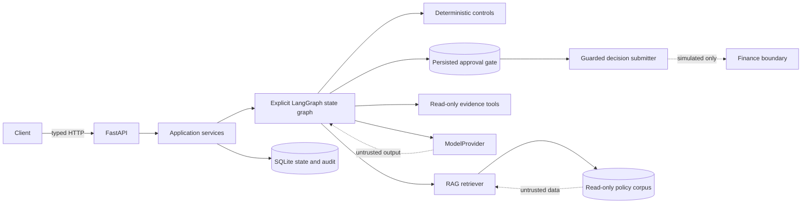

# Architecture

This local foundation favors explicit control and inspectable boundaries. FastAPI validates transport data and delegates to services. Services coordinate repositories and, in later tasks, an explicit LangGraph workflow. Domain code owns enforceable rules. Model and tool adapters remain replaceable boundaries rather than sources of authority.



## Workflow

```text
START -> VALIDATE_REQUEST -> RETRIEVE_POLICY -> GATHER_EVIDENCE
      -> RECONCILE -> POLICY_ANALYSIS -> BUILD_RECOMMENDATION
      -> COMPLETE | WAITING_FOR_APPROVAL
WAITING_FOR_APPROVAL -> APPROVE/REJECT
APPROVE -> SUBMIT_FINANCE_DECISION -> COMPLETE
REJECT  -> COMPLETE
any active state -> FAILED
```

The graph is bounded by deterministic step and tool-call counters. Foundation nodes compile but fail explicitly if executed; the API currently persists a `CREATED` run and does not pretend the unfinished workflow ran.

`WAITING_FOR_APPROVAL` is persisted state, not a long-running HTTP connection. A later callback reloads the same state, verifies identity/authority and idempotency, records the decision, and resumes at the controlled continuation. A rejection completes without submission. Submission requires validated arguments, a recorded approval, and a unique idempotency key.

## Trust and failure boundaries

- Request text, attachments, retrieved chunks, tool responses, and model output are untrusted at entry and schema-validated.
- Source permissions and policy status are enforced before generation. Prompt wording cannot upgrade authority.
- Read tools have narrow typed contracts, timeouts, bounded retries, and observable results. The consequential submitter is a separate deny-by-default interface.
- SQLite holds resumable state and ordered audit events. General logs contain correlations and outcomes, not full financial secrets.
- The LLM provider, model labels, timeout, and retry count come from settings. No live provider is required for stable tests.

## Component manifest

### Deterministic finance controls (Task 3)

Typed fixture-backed read-only tools feed deterministic duplicate, vendor, three-way-match, authority, and outcome services. Tool failures stay distinct from business mismatches. Executable rules are reviewed application constants with policy references; RAG content cannot change them. See `docs/finance-controls.md`.

| Component | Foundation choice | Status |
| --- | --- | --- |
| API | FastAPI | Implemented skeleton |
| Agent runtime | LangGraph explicit graph | Topology only |
| Persistence | SQLAlchemy + SQLite | Foundation implemented |
| Document store/index | Local JSON BM25/TF-IDF index | Implemented |
| Model | Configured `ModelProvider`; disabled default | Boundary only |
| Evidence tools | Typed vendor/PO/history contracts | Boundary only |
| Consequential tool | Approval-gated simulated submitter | Boundary only |

No cloud resources or cleanup costs exist in this local design.
