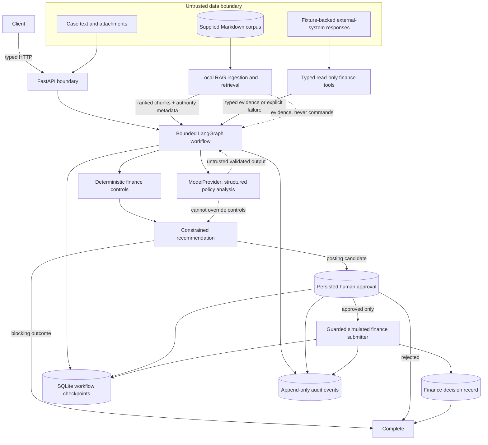

# Architecture

The application is a bounded Accounts Payable decision-support workflow. FastAPI owns transport;
LangGraph owns explicit routing; deterministic services own finance truth; the model performs only
validated synthesis; SQLite owns durable checkpoints, approvals, decisions, and audit history.



There is intentionally no edge from the model or RAG directly to the submitter. The submitter queries
persistence for an approved decision rather than trusting a caller-provided flag, model statement, or
retrieved instruction.

## Workflow topology

```text
START -> VALIDATE_REQUEST -> RETRIEVE_POLICY -> GATHER_EVIDENCE
      -> RECONCILE -> POLICY_ANALYSIS -> BUILD_RECOMMENDATION
      -> COMPLETE | CREATE_APPROVAL_REQUEST -> WAITING_FOR_APPROVAL

later callback:
WAITING_FOR_APPROVAL -> RESOLVE_APPROVAL
    REJECT  -> COMPLETE
    APPROVE -> SUBMIT_FINANCE_DECISION -> COMPLETE

any active stage -> FAILED
```

Each meaningful node consumes a persisted step or tool-call budget. LangGraph supplies routing but no
second checkpoint store: `runs.state_payload` is the sole typed resumable snapshot. Waiting for human
approval ends execution and returns HTTP; a later callback loads and resumes the same run.

## Responsibility boundaries

- **FastAPI:** validates typed HTTP requests and maps domain failures to status codes; it contains no
  finance rules.
- **LangGraph:** sequences fixed nodes, enforces budgets, and selects application-controlled edges.
- **RAG:** returns read-only cited evidence with relevance, authority, trust, and status metadata.
- **Read-only tools:** simulate bounded vendor, PO/receipt, and invoice-history integrations while
  preserving `NOT_FOUND`, `TIMEOUT`, `TRANSIENT_FAILURE`, and `INVALID_REQUEST` semantics.
- **Deterministic services:** own Decimal calculations, reconciliation, duplicates, evidence checks,
  policy thresholds, outcome precedence, and approval requirements.
- **Model provider:** produces validated source-linked analysis without an outcome/action field.
- **Approval and submitter:** persist human intent and independently enforce the consequential boundary.
- **SQLite and audit:** provide local restart/resume, uniqueness constraints, and sanitized history.

## Trust and failure boundaries

Request content, supplier material, retrieved chunks, external tool responses, and model output are
untrusted at entry. Pydantic validates boundaries; current-policy eligibility is checked before an LLM
finding can be authoritative. Prompt injection remains retrievable evidence but has no execution path.

Timeouts and transient tool failures are retried at most once by default and remain unknown evidence
after exhaustion. Malformed model output and invalid citations receive a bounded repair attempt and
then fail safely. No model call performs arithmetic or selects a consequential tool.

See the [component manifest](component-manifest.md), [workflow sequence](workflow.md), and
[design note](design-note.md) for implementation details and production trade-offs.
