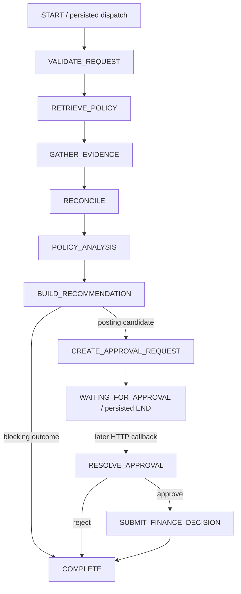
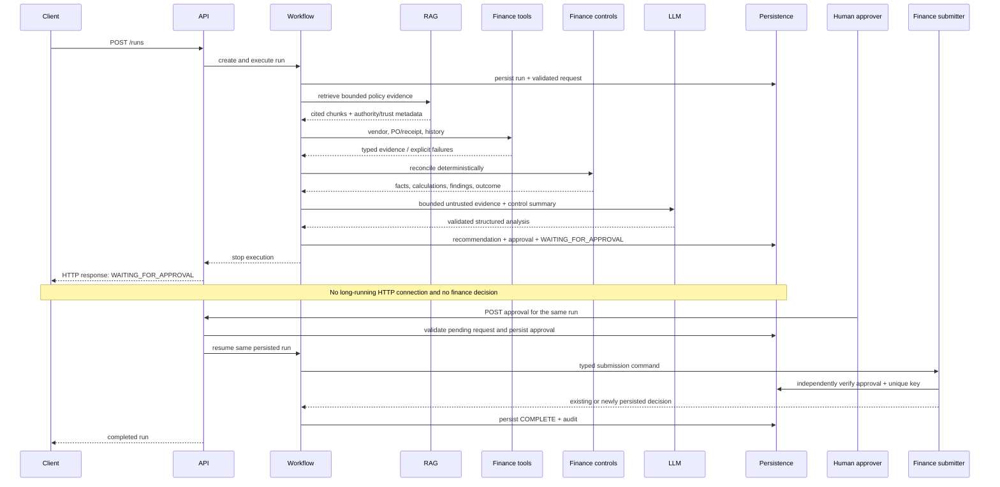
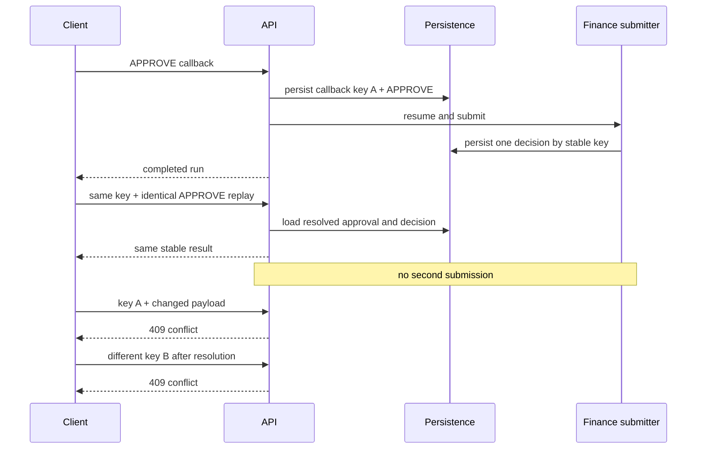

# Workflow, approval, and safe resume

The bounded LangGraph workflow controls node routing; SQLite is the sole durable checkpoint and financial source of truth. Every meaningful node persists a typed `WorkflowSnapshot`, counters, current node, next resumable stage, and sanitized audit event.

## Boundaries

The public request remains `FinancialCase`. A fixture-backed simulated invoice-source boundary resolves full `InvoiceEvidence` by case ID and rejects summary mismatches. RAG results, case notes, supplier text, and model output remain untrusted. Read-only finance tools are retried at most once for timeout or transient failure; not-found and invalid requests are not retried. Every attempt consumes the persisted tool budget.

The deterministic finance-control service remains authoritative. A gathered-evidence adapter prevents reconciliation from calling upstream tools twice. The model receives only bounded retrieved chunks and a deterministic summary. Its strict `PolicyAnalysis` output has no outcome or action field. Citation IDs must have been retrieved, and authoritative policy findings may cite only current-authority chunks.

Normal runs use one model call. Malformed output, invalid citations, timeout, HTTP 408/409/429, network errors, and 5xx responses receive up to `LLM_MAX_RETRIES` additional attempts. Other provider errors fail immediately. Exhaustion persists `FAILED`; prompts and full evidence are not audited.

## Approval and submission

The approver directory is synthetic and validates only fixture identity, claimed role, active status, and AUD limit. It is not enterprise authentication. Submission has no real finance-system capability. It queries persisted approval and denies caller/model claims of approval.

Approval-request and finance-decision keys are SHA-256 hashes of versioned canonical identities. Approval callback replay identity is the persisted callback idempotency key: the same key with the same semantic payload returns the existing result. Reusing that key with different content, or sending a different key after the approval is resolved even when its business payload is identical, is rejected without rewriting history. The database retains a uniqueness constraint on callback keys and permits one effective finance decision per run.

If approval is committed before a crash, a repeated callback resumes the `RUNNING` stage. If the simulated decision and checkpoint commit but the response is lost, replay returns the stored decision. A production external integration would use an outbox and downstream idempotency key; this local simulation makes the database row the consequential effect.

## Live model configuration

Set `LLM_PROVIDER=openai_compatible`, the provider's exact documented `LLM_MODEL`, `LLM_BASE_URL` ending at its API version prefix, and `LLM_API_KEY`. The adapter calls `POST {LLM_BASE_URL}/chat/completions` with strict JSON Schema output. Disabled mode fails a run clearly and never falls back to a fake provider. `LLM_COMPLEX_MODEL` is reserved and no automatic routing exists.

## Production boundary

The local fixture tools, invoice source, approver directory, and finance submission are deliberately
simulated. The authoritative limitations and production evolution are maintained in the
[design note](design-note.md#limitations-and-production-evolution).
